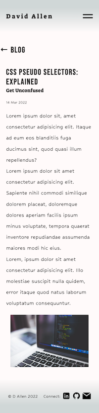

# Portfolio Website

## Site Links

View the finished site [HERE](https://dallencode.netlify.app)  
View the GitHub Repository [HERE](https://github.com/dallencode/portfolio-website)

---

## Purpose

The purpose of this website is to showcase the skills I have learnt in my first term at [Coder Academy](https://www.coderacademy.edu.au) and market those skills to potential employers.

With a simplistic design, the intention is to showcase an ability to communicate succinctly, show personality and ensure accessibility is of utmost importance.

## Functionality / Features

Some of the features of this website include:

- Wide use of Semantic HTML
- Responsiveness across a range of devices, achieved largely due to CSS Flex-box and Grid
- CSS animations to improve user enjoyment
- Navbar accessible on all pages
- Hamburger menu on smaller devices
- Use of web-optimised images to improve performance
- Social media links accessible on all pages

## Sitemap

## Screenshots of completed site

  
Desktop

  
Mobile

## Target audience

The target audience of this website include:

- Potential employers in the tech industry
- Other developers looking to collaborate
- Like-minded artists and creatives searching for a web developer

## Tech Stack

This website was created using the following technologies:

- HTML 5
- CSS 3
- JavaScript
- Git
- Netlify
